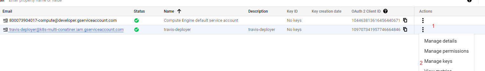

1. Create new Project in GG cloud
2. Chọn Kubernetes Engine > Enable Kubernetes Engine API
3. Refresh lại sẽ thấy yêu cầu tạo kubernetes cluster > chọn tạo mới > GKE Standard
4. Điền thông Cluster basics:
- name: k8s-multi-cluster
- Location type: Zonal
- zone-name: asia-southeast-1-a
- Control plane version: Release channel
- Release channel: chọn default
- Chọn NODE POOLS > default pool để tùy chỉnh cấu hình
- Chọn Cluster > Network. Chọn private > 
    + Control plane IP range: 172.16.0.0/28
- Bấm create chờ 5 phút
5. truy cập vào phần Service Account của gg cloud
- SideBar -> IAM&Admin > Service Account > Create Service Account
- fill 1 số thông tin:
    + Step 1: Service account name: travis-deployer
    + Step 2: Role of user: "Kubernetes Engine Admin"
    + step 3: continue > done
- get manager key: options > manage keys

- Chọn "Add Key" > "Create new key" > "Json"

- copy key.json vào folder dự án name "service-account.json"
6. config travis-ci để tránh lộ thông tin service-account.json vừa tải xuống

6.1
> $ docker-run -it -v $(pwd):/app ruby:2.4 sh (mac or linux)

6.2
> $ docker-run -it -v ${pwd}:/app ruby:2.4 sh (windows)

6.3
> $ cd app

6.4
> $ gem install travis

(login with github: follow theo https://docs.github.com/en/authentication/keeping-your-account-and-data-secure/creating-a-personal-access-token)

6.5. option 1

> $ travis login  --github-token YOUR_PERSONAL_TOKEN --com

> $ travis login  --github-token 2323232212121 --com

> $ travis encrypt-file service-account.json -r duong-dx/k8s-multi-container --com

6.5. option 2

> $ travis login  --github-token YOUR_PERSONAL_TOKEN --pro

> $ travis login  --github-token 2323232212121 --pro

> $ travis encrypt-file service-account.json -r duong-dx/k8s-multi-container --pro

6.6. Xóa file gốc "service-account.json" vì đã có file "service-account.json.enc"

6.7. Sau khi chạy 6.5 xong copy openssl response page to .travis.yml > before_install
