Cấu trúc dự án
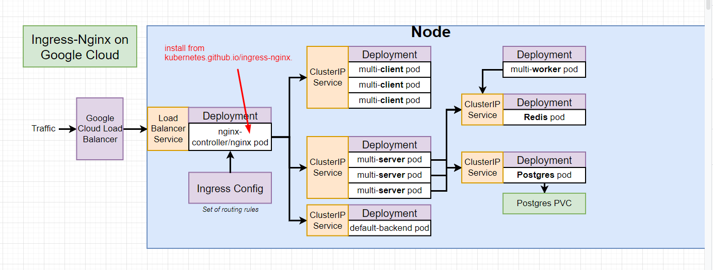
1. Create new Project in GG cloud
2. Chọn Kubernetes Engine > Enable Kubernetes Engine API
3. Refresh lại sẽ thấy yêu cầu tạo kubernetes cluster > chọn tạo mới > GKE Standard
4. Điền thông Cluster basics:
   - name: k8s-multi-cluster
   - Location type: Zonal
   - zone-name: asia-southeast1-a
   - Control plane version: Release channel
   - Release channel: chọn default
   - Chọn NODE POOLS > default pool để tùy chỉnh cấu hình
   - Chọn Cluster > Network. Chọn private > 
       + Control plane IP range: 172.16.0.0/28
   - Bấm create chờ 5 phút
5. truy cập vào phần Service Account của gg cloud
   - SideBar -> IAM&Admin > Service Account > Create Service Account
   - fill 1 số thông tin:
       + Step 1: Service account name: travis-deployer
       + Step 2: Role of user: "Kubernetes Engine Admin"
       + step 3: continue > done
   - get manager key: options > manage keys
   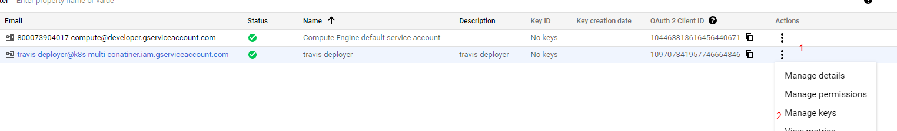
   - Chọn "Add Key" > "Create new key" > "Json"
   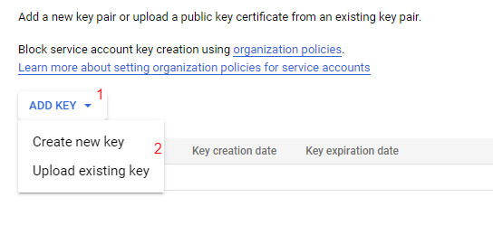
   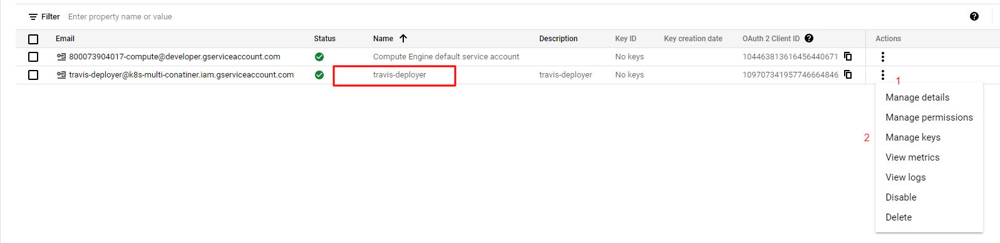
   - copy key.json vào folder dự án name "service-account.json"
6. config travis-ci để tránh lộ thông tin service-account.json vừa tải xuống

6.1
> $ docker-run -it -v $(pwd):/app ruby:2.4 sh (mac or linux)

6.2
> $ docker-run -it -v ${pwd}:/app ruby:2.4 sh (windows)

6.3
> $ cd app

6.4
> $ gem install travis

(login with github: follow theo https://docs.github.com/en/authentication/keeping-your-account-and-data-secure/creating-a-personal-access-token)

6.5. option 1

> $ travis login  --github-token YOUR_PERSONAL_TOKEN --com

> $ travis login  --github-token 2323232212121 --com

> $ travis encrypt-file service-account.json -r duong-dx/k8s-multi-container --com

6.5. option 2

> $ travis login  --github-token YOUR_PERSONAL_TOKEN --pro

> $ travis login  --github-token 2323232212121 --pro

> $ travis encrypt-file service-account.json -r duong-dx/k8s-multi-container --pro

6.6. Xóa file gốc "service-account.json" vì đã có file "service-account.json.enc"

6.7. Sau khi chạy 6.5 xong copy openssl response page to .travis.yml > before_install
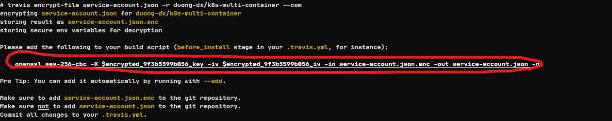

6.8 Build docker image
> phân nhánh làm 2 trường hợp: 1. version docker latest 2. đánh số version

6.8.1 version docker latest
- Build docker image

> $ docker build -t [docker_id]/[image_name] -f [path/Dockerfile] [path]

> $ docker build -t duong1200798/multi-client -f ./client/Dockerfile ./client

- Push image to docker hub
> $ docker push [docker_id]/[image_name]

> $ docker push duong1200798/multi-client

- set image for container
> $ kubectl set [object]/[object_name] [container_name]=[docker_id]/[image_name]

> $ kubectl set deployments/server-deployment server=duong1200798/multi-server

6.8.2 Build docker have tag version "theo commit id"
- Get $git_sha

> $ git rev-parse HEAD

> result: 745181d3604ebbd274bd311212121

- Build docker image

> $ docker build -t [docker_id]/[image_name]:[version] -f [path/Dockerfile] [path]

> $ docker build -t duong1200798/multi-client:745181d3 -f ./client/Dockerfile ./client

- Push image to docker hub
> $ docker push [docker_id]/[image_name]:[version]
>
> $ docker push duong1200798/multi-client:745181d3

- set image for container
> $ kubectl set [object]/[object_name] [container_name]=[docker_id]/[image_name]:[version]

> $ kubectl set deployments/server-deployment server=duong1200798/multi-server:745181d3

- cần sửa lại các image  trong k8s .yaml file với image name: version tương ứng

7. Create secret trên Google cloud K8s cluster

7.1 Option1: ssh to cluster và chạy 

> $ kubectl create secret generic postgres-password --from-literal POSTGRES_PASSWORD=password

7.2 Option1: ssh to cluster và chạy
- Chon GKE (Google Kubernetes Engine)
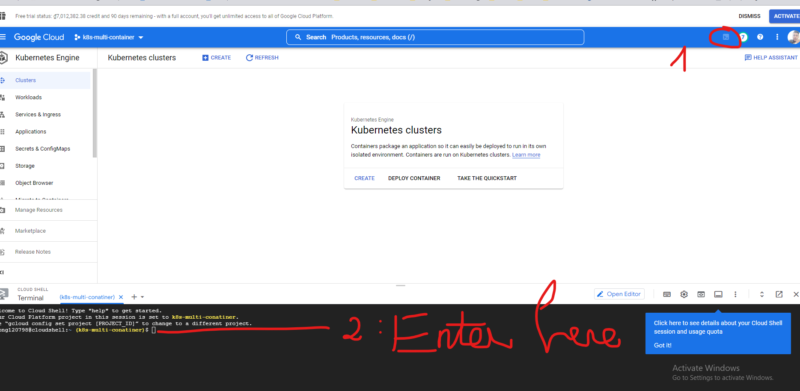
- set project
> $ gcloud config set project [project_id]
 
> $ gcloud config set project k8s-multi-conatiner

- set zone
> $ gcloud config set compute/zone [zone]

> $ gcloud config set compute/zone asia-southeast1-a

- set container cluster
> $ gcloud container clusters get-credentials [cluster-id]

> $ gcloud container clusters get-credentials k8s-multi-cluster

- set secret
> $ kubectl create secret generic postgres-password --from-literal POSTGRES_PASSWORD=password

7.3 GKE (Google Kubernetes Engine) > chọn Cluster đã tạo > chọn "Secret and ConfigMap" (để xem secret đã tạo)

8. install helm
 - Do dưới local đang dùng minikube và dùng "minikube addons enable ingress" để install 
    các resource liên quan đến nginx-ingress nhưng "trên server sẽ không hiểu điều này"

8.1 Truy cập vào trang chủ kubernetes ingress-nginx
   https://github.com/kubernetes/ingress-nginx/ rồi tìm đến  => https://kubernetes.github.io/ingress-nginx/
    => chọn using with Helm

8.2 Helm + Tiller
 - [command we issue] -> [Helm client] -> [Tiller Server]
 - truy cập github.com/helm/helm > Đến trang chủ Helm > chọn Docs > chọn "Install Helm"
  tiếp tục chọn "From Script"

8.3 Truy cập Google Cloud Console (Flow Docs)

Đây chỉ là demo với version hiện tại (follow follow https://docs.google.com/document/d/1HS1jvc6rUD_6LJ5zUvrtns9mozoYvivlY3Jsohmks9I/edit)
> $ curl -fsSL -o get_helm.sh https://raw.githubusercontent.com/helm/helm/main/scripts/get-helm-3

> $ chmod 700 get_helm.sh

> $ ./get_helm.sh

> $ helm upgrade --install ingress-nginx ingress-nginx \
--repo https://kubernetes.github.io/ingress-nginx \
--namespace ingress-nginx --create-namespace
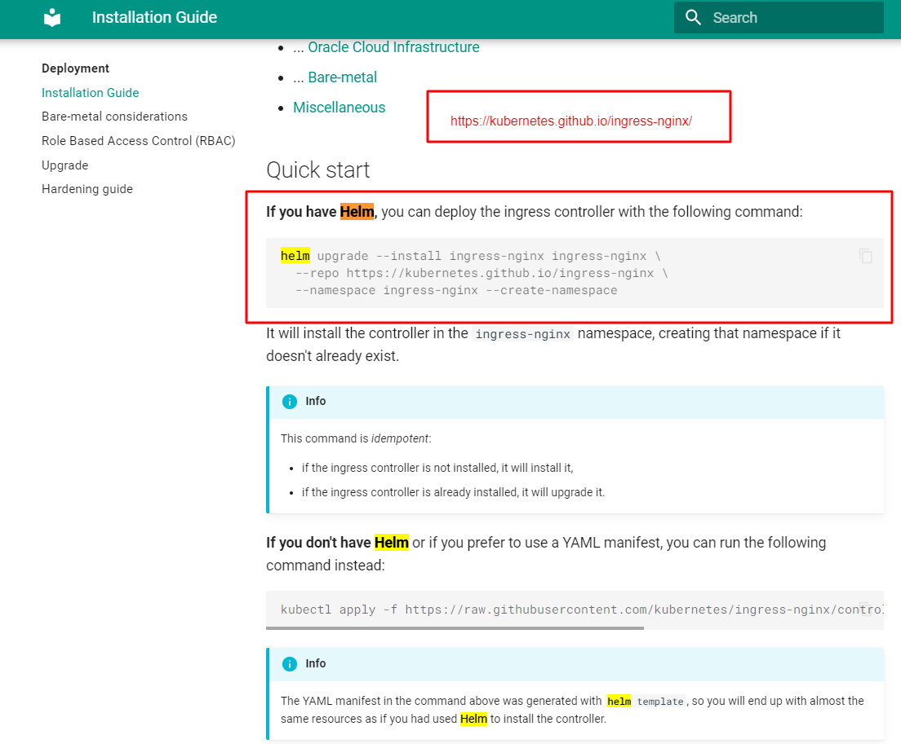 
> $ kubectl get all -n ingress-nginx #get all resource of ingress-nginx namespace

- Kiểm tra kết quả
  + Chọn Kubernetes Engine > Workload
   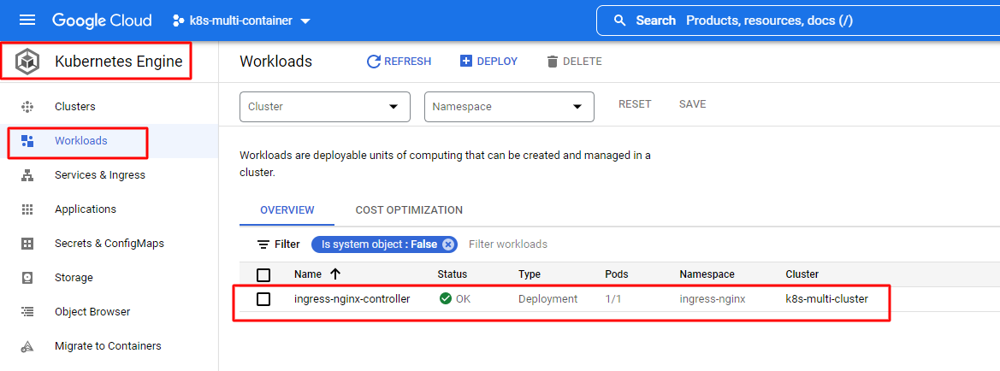
  + Chọn Kubernetes Engine > Service And Ingress
  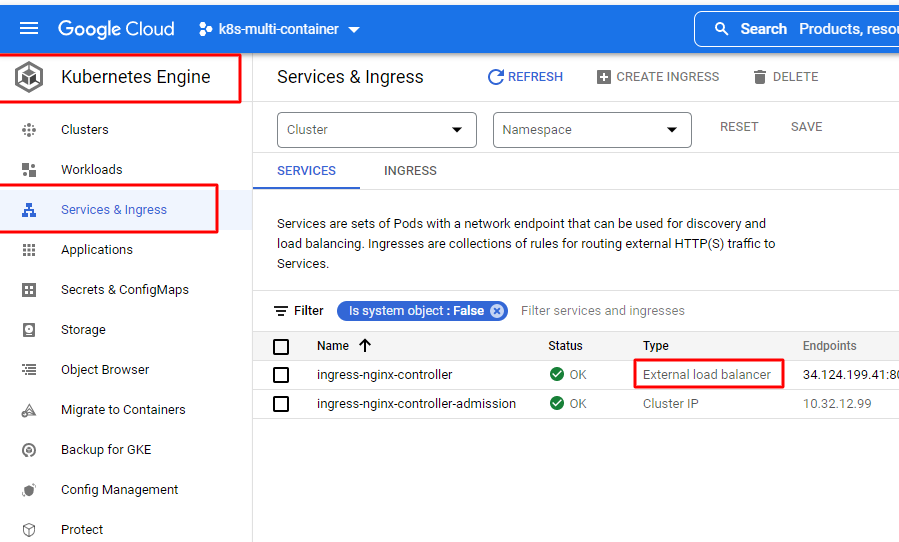
  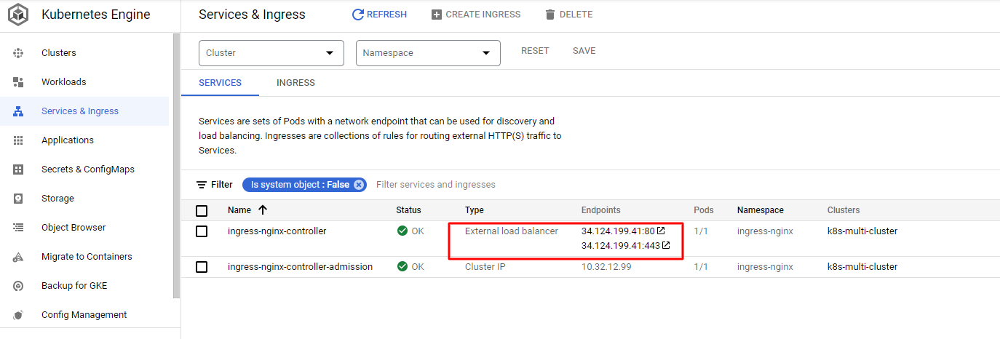

9. Setting domain With nameCheap (DNS là dinhxuanduong.website)

- go to NameCheap console > Domain List > Chọn mangae của domainname
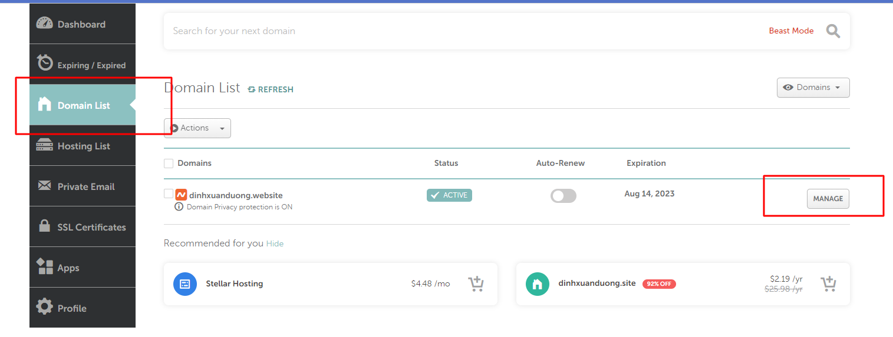
- Chọn Advanced DNS > ADD NEW RECORD > thêm IP của "Ingress-nginx-controller"
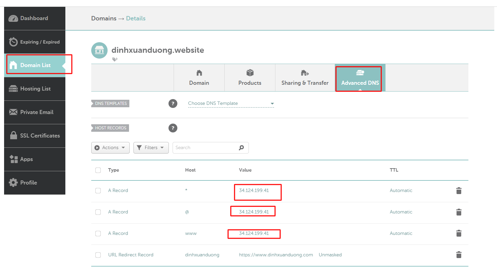

10. Active Ssl of namecheap (DNS là dinhxuanduong.website)
- NameCheap console > ssl certificate > Chọn active
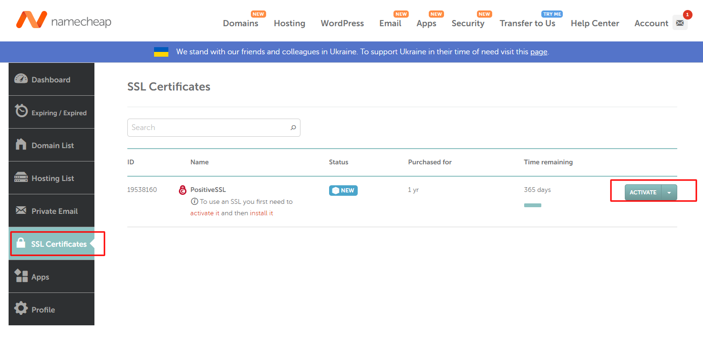 
- Trên google cloud console
> $ mkdir ssl-certs
 
> $ cd mkdir ssl-certs

> $ openssl req -new -newkey rsa:2048 -nodes -keyout yourdomain_tld.key -out yourdomain_tld.csr

> $ openssl req -new -newkey rsa:2048 -nodes -keyout dinhxuanduong_website.key -out dinhxuanduong_website.csr

11. Install Cert Manager trên google cloud console 
- Cert manager dùng để add ssl certificate cho K8s
- (flow by https://cert-manager.io/docs/installation/helm/#prerequisites)

> $ helm repo add jetstack https://charts.jetstack.io

> $ helm repo update

cách 1:
 - CRD resources
> $ kubectl apply -f https://github.com/cert-manager/cert-manager/releases/download/v1.9.1/cert-manager.crds.yaml
 - install 
> $ helm install \
    cert-manager jetstack/cert-manager \
    --namespace cert-manager \
    --create-namespace \
    --version v1.9.1 

cách 2: 
> $ helm install \
    cert-manager jetstack/cert-manager \
    --namespace cert-manager \
    --create-namespace \
    --version v1.9.1 \
    --set installCRDs=true # Khác ở đây "--set installCRDs=true" do cert-manager requires cần thêm CRD resources
- check install thành công hay chưa
> $ kubectl get pods --namespace cert-manager

